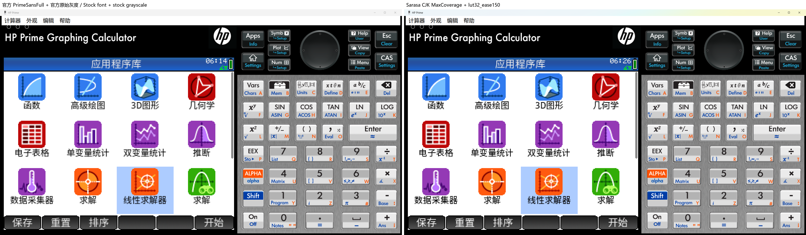
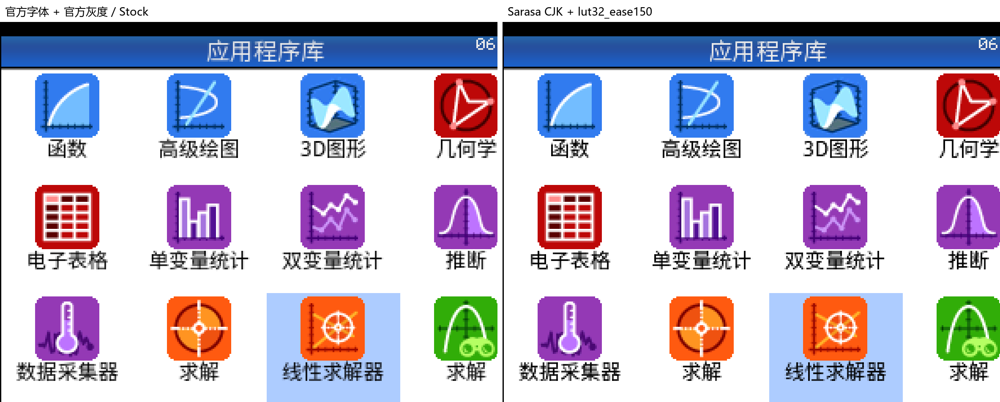

# HP Prime G1 font rendering and Sarasa CJK hybrid patch

[中文](#中文说明) · [English](#english)

## 中文说明

本仓库记录并复现针对 HP Prime G1 官方 `20250915` 固件的实验性字体渲染修改。项目最初研究 `softcut64` 灰度裁切，现已扩展到 LUT 灰度曲线及 Prime Sans + 更纱黑体（Sarasa Gothic）CJK 混合字体。

当前实机候选为 `lut32_ease150 + Sarasa CJK MaxCoverage`：

- 非 CJK 字符保留 HP Prime 原始 `Prime Sans` 字形；
- CJK 统一表意文字范围（`U+3400–4DBF`、`U+4E00–9FFF`、`U+F900–FAFF`）来自 Sarasa Gothic；
- 混合字体使用 `256 UPM`，并保持固件要求的 `Prime Sans / PrimeSansFull` 内部名称；
- 覆盖 16,914 个 Sarasa CJK 码位，同时保留 2,632 个 Prime 非 CJK 字符；
- 字体为 4,613,200 字节，可放入 4,613,520 字节的固定槽位；
- 渲染器使用 `lut32_ease150` 灰度查表曲线。

### 状态

- 目标：仅 HP Prime G1，官方 `20250915` 固件。
- 模拟器无损截图对比：已完成。
- 固件静态、FAT16、字体槽、内部/外部 MD5 验证：通过。
- Connectivity Kit 缓存安装流程：已在本机验证。
- 实机效果与长期稳定性：仍需用户自行验证。

### 无损视觉对比

左侧是官方 `PrimeSansFull + 官方原始灰度`，右侧是 `Sarasa CJK MaxCoverage + lut32_ease150`。截图来自相同模拟器场景；PNG 未经过有损压缩。完整窗口图以 2 倍无损捕获，下面的 LCD 图保留捕获图中的原始像素，不再缩放。

[打开完整分辨率图片](images/stock-vs-sarasa-cjk-lut32-ease150-full.png)

[打开 LCD 原像素图片](images/stock-vs-sarasa-cjk-lut32-ease150-lcd-native.png)

### 仓库不包含

由于版权、许可和安全原因，本仓库不提供 HP 官方固件、模拟器、Connectivity Kit、提取出的 HP 字体、修改后的 `PRIME_APP.DAT` 或完整混合 TTF。请自行取得官方文件并在本地生成产物。

### 从哪里开始

- [混合字体与 lut32_ease150 说明](docs/19-sarasa-cjk-lut32-ease150.md)
- [Connectivity Kit 缓存刷入](docs/06-flashing-with-connectivity-kit-cache.md)
- [回滚与恢复](docs/07-rollback-and-recovery.md)
- [实机测试清单](docs/11-hardware-test-checklist.md)
- [Round 4 LUT 候选](docs/18-round4-hardware-validation-packages.md)

### 重要警告

修改并刷写固件可能导致数据丢失、无法启动或需要恢复。刷入前请备份计算器数据，逐项核对固件版本和哈希，并准备官方原版恢复包。不要用于 G2。

## English

This repository documents and reproduces experimental font-rendering modifications for the official HP Prime G1 `20250915` firmware. It began with the `softcut64` grayscale cutoff and now also covers LUT-based grayscale curves and a Prime Sans + Sarasa Gothic CJK hybrid font.

The current hardware candidate is `lut32_ease150 + Sarasa CJK MaxCoverage`:

- non-CJK characters retain the original HP Prime `Prime Sans` glyphs;
- CJK unified ideographs in `U+3400–4DBF`, `U+4E00–9FFF`, and `U+F900–FAFF` come from Sarasa Gothic;
- the hybrid uses `256 UPM` and preserves the firmware-facing `Prime Sans / PrimeSansFull` names;
- 16,914 Sarasa CJK code points are included while all 2,632 Prime non-CJK characters are retained;
- the font is 4,613,200 bytes and fits the fixed 4,613,520-byte slot;
- grayscale rendering uses the `lut32_ease150` lookup curve.

### Status

- Target: HP Prime G1 only, official `20250915` firmware.
- Lossless simulator comparison: complete.
- Static firmware, FAT16, font-slot, and inner/outer MD5 verification: passed.
- Connectivity Kit cache installation workflow: locally verified.
- Hardware appearance and long-term stability: still user-validated experimental work.

### Lossless visual comparison

The left side uses stock `PrimeSansFull + stock grayscale`; the right side uses `Sarasa CJK MaxCoverage + lut32_ease150`. Both screenshots use the same emulator scene and lossless PNG encoding. The full-window image is a lossless 2× capture, while the LCD crop preserves the captured pixels without additional scaling. See the comparison images in the Chinese section above or open the [full-resolution comparison](images/stock-vs-sarasa-cjk-lut32-ease150-full.png) and [native-pixel LCD crop](images/stock-vs-sarasa-cjk-lut32-ease150-lcd-native.png).

### Not included

For copyright, licensing, and safety reasons, this repository does not distribute HP firmware, the simulator, Connectivity Kit, extracted HP fonts, patched `PRIME_APP.DAT`, or the complete hybrid TTF. Obtain the official inputs yourself and build artifacts locally.

### Start here

- [Hybrid font and lut32_ease150](docs/19-sarasa-cjk-lut32-ease150.md)
- [Flashing through the Connectivity Kit cache](docs/06-flashing-with-connectivity-kit-cache.md)
- [Rollback and recovery](docs/07-rollback-and-recovery.md)
- [Hardware test checklist](docs/11-hardware-test-checklist.md)
- [Round 4 LUT candidates](docs/18-round4-hardware-validation-packages.md)

### Warning

Modified firmware can cause data loss, boot failure, or require recovery. Back up calculator data, verify the exact firmware version and every hash, and keep a stock recovery package ready. Do not use this on G2 hardware.

## Repository contents

- `docs/` — research, reproduction, flashing, recovery, and validation notes.
- `patches/` — public-safe renderer patch manifests.
- `scripts/` — renderer reproduction helpers.
- `tools/connectivity-cache/` — cache verification, installation, and restoration helpers.
- `images/` — lossless emulator comparisons that are safe to redistribute.
- `reports/` — analysis results and rejected/experimental routes.

License and third-party attribution are described in [LICENSE](LICENSE) and [NOTICE.md](NOTICE.md).
