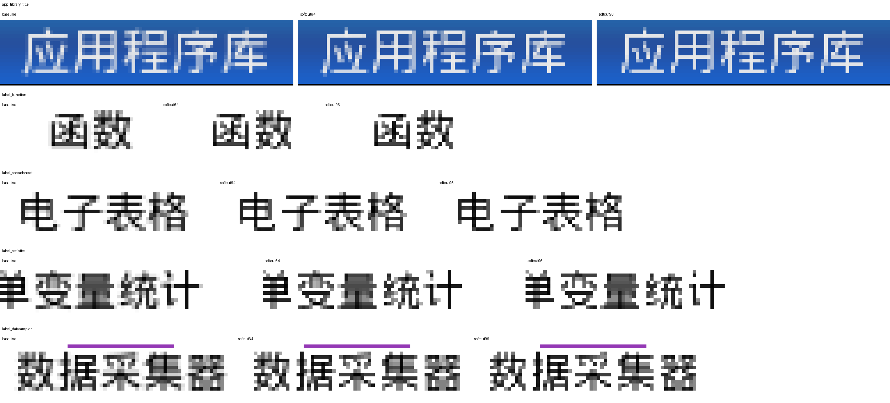
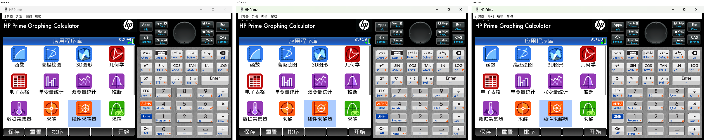
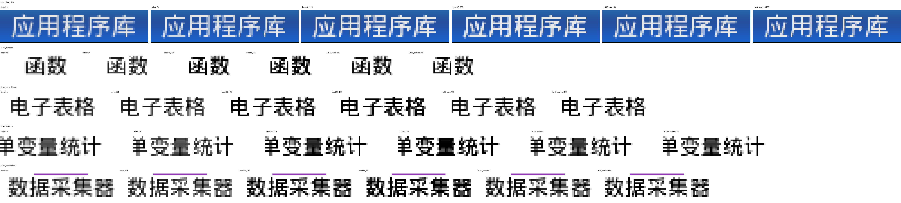
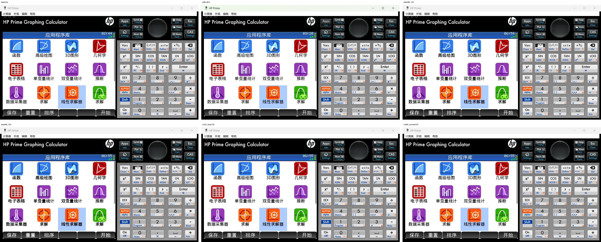

# Visual Comparison

模拟器阶段生成了原版和 `softcut64` 的对比图，用于确认不再采用硬阈值路线。

## Crops

## Full comparison

## Round3 Crops

Round3 compares the original simulator output, `softcut64`, two linear boost
variants, and two LUT coverage-curve variants.

## Round3 Full Comparison

## 视觉结论

硬阈值路线会让低分辨率中文文字出现明显黑块和粘连。`softcut64` 没有把所有边缘直接压成黑白，而是只清掉 coverage `<64` 的浅灰边，因此更适合继续实机验证。

Round3 中，`lut32_ease150` 更像“曲线调校”：保留一部分边缘信息，同时减少发灰；`boost48_125` 更直接增重；`boost48_150` 和 `lut48_contrast150` 更锐利，但也更容易让密集中文发黑。

这张图不是最终硬件验收。实机 LCD、缩放、拍照和模拟器渲染都会带来差异。它的作用是筛掉明显错误的参数方向，并给硬件首刷选择一个风险较低的候选。
