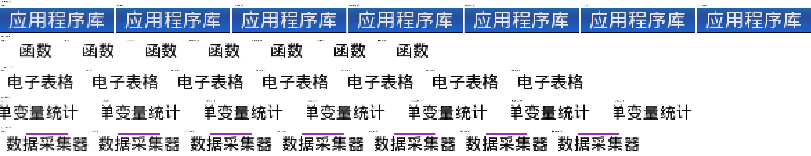
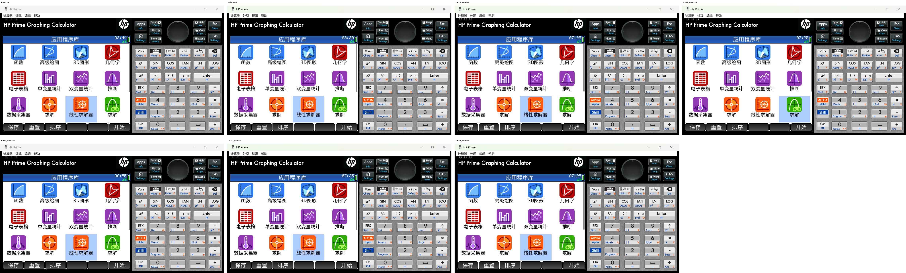

# LUT Fine-Tune Preview

After the first round3 preview, `lut32_ease150` looked like the best balanced
candidate.  This pass keeps the same LUT method and explores nearby parameters
instead of introducing a new renderer or replacing fonts.

## Variants

All variants use:

```c
if (coverage < low) {
    out = 0;
} else {
    t = (coverage - low) / (255 - low);
    out = 255 * (1 - (1 - t)^gamma);
}
```

The fine-tune set is:

| Variant | Meaning | Expected look |
| --- | --- | --- |
| `lut24_ease140` | Lower cutoff, softer gamma | Most natural; keeps more edge coverage |
| `lut32_ease135` | Same cutoff as `lut32_ease150`, gentler gamma | Conservative refinement |
| `lut32_ease150` | Current balanced reference | Middle of the set |
| `lut32_ease170` | Same cutoff, stronger gamma | Heavier and harder |
| `lut40_ease150` | Higher cutoff, same gamma | Sharper edge cleanup |

## Simulator Preview

The preview compares:

```text
baseline
softcut64
lut24_ease140
lut32_ease135
lut32_ease150
lut32_ease170
lut40_ease150
```

### Crops



### Full Page



The metric report is
[reports/lut_finetune_preview_metrics.md](../reports/lut_finetune_preview_metrics.md).

## Static Verification Results

For official G1 20250915 input:

| Variant | armfir.elf MD5 | PRIME_APP.DAT MD5 |
| --- | --- | --- |
| `lut24_ease140` | `bf109f4503f19bb32f9e20b527351af8` | `88868bf2a056c53aec743e5ef19cbbcd` |
| `lut32_ease135` | `31d44fc2ccb0aa035d320f33d34c4174` | `13e7afa153cf4658ce54473ae1049ef8` |
| `lut32_ease170` | `683c39c3d9b6fd6a8b6b51e76020ad88` | `edc2de5e73bb85cd3f4d59a96b7b18f1` |
| `lut40_ease150` | `4c191a21d7b95bba7f7fd1c2fddd1c37` | `21910427215ce54270b86bbe75074a74` |

Verification covered:

- patched ELF keeps the original `8230724` byte size;
- patched ELF still has ELF magic;
- patched ELF equals source plus manifest bytes only;
- `programs/misc/armfir.elf` is written back at the same FAT16 file size;
- `APPSLIST.MD5` matches the patched `armfir.elf`;
- outer `Prime_FW.md5` matches patched `PRIME_APP.DAT`.

## Current Read

`lut32_ease150` is still the best middle choice if the goal is clearer text
without making the screen feel harsh.  If the real LCD makes it look too heavy,
`lut32_ease135` is the safer next step.  If it still looks too soft,
`lut32_ease170` or `lut40_ease150` are the next sharper tests.
